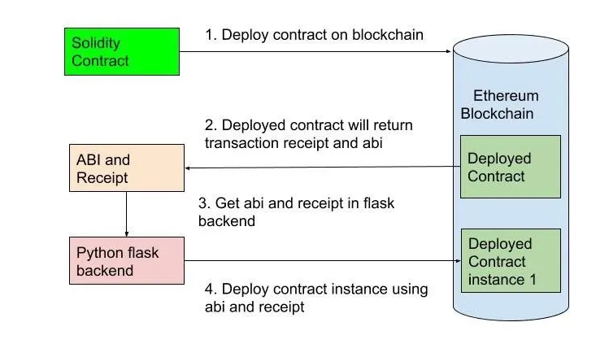

https://blog.miguelgrinberg.com/post/how-to-create-a-react--flask-project

# Configuration du projet

Créer un environnement virtuel python :
- cd api
- python -m venv venv
- source venv/bin/activate

Installer les dépendances dans l'environnement virtuel :
- pip install -r requirements.txt

Creer la base de données (locale au projet, utilisation de SQLite) :

- cd api
- python init_db.py

Lancer le backend :

- cd api
- flask run

Lancer le frontend (dans un autre terminal):

- aller a la racine du projet
- npm install
- npm run start

Lancer ganache (dans un autre terminal) :
Ganache est simulation d'un noeud Ethereum local. Il permet de tester les smart contracts sans avoir à déployer sur la blockchain.
- aller a la racine du projet
- npm install ganache --global 
- ganache

# Explication du projet

// image smart_contract_flask_ether.png in .md file

Pour mettre tous les paquets python dans un fichier requirements.txt :
- pip freeze > requirements.txt
